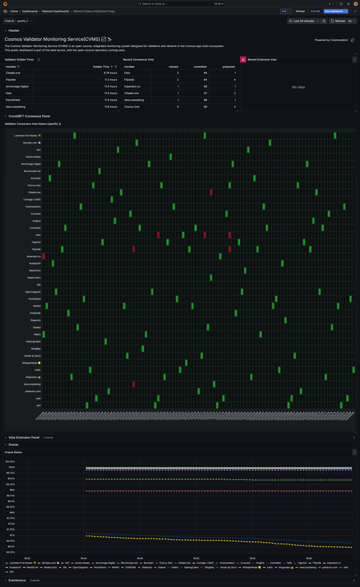
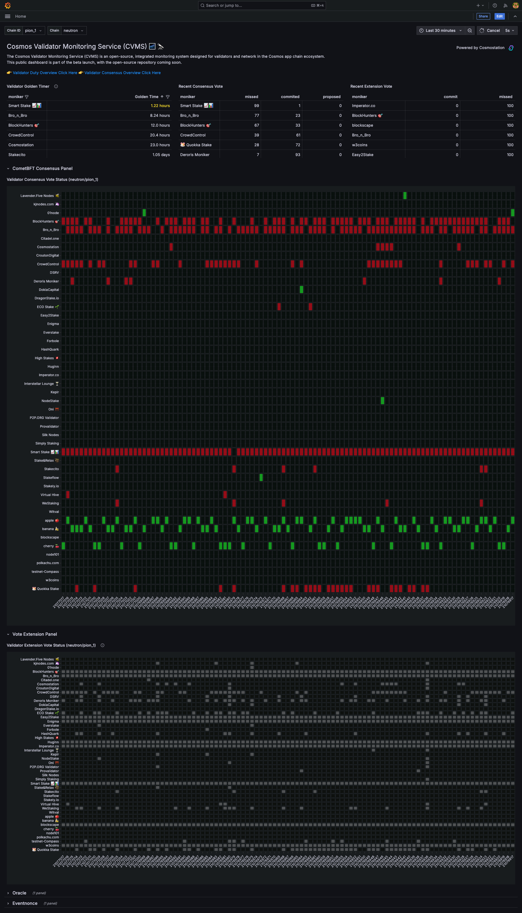

# Cosmos Validator Monitoring Service(CVMS) 🌌 🔭

✅ Validators in Cosmos-SDK-based chains sometimes have additional responsibilities beyond block production. In this document, we refer to these responsibilities as `duties`.

## Background About CVMS

The Cosmos ecosystem comprises app chains built on Cosmos-SDK, which, despite having similar system architectures, often **require validators to perform a wider range of customized duties (like oracle or EVM bridging services)** in addition to maintaining standard consensus security.

For example, a duty might have different names or applications across Chain A and Chain B.

As a result, **validators use different custom paths designated by each app chain to check their current status and prevent penalties, such as slashing, when performing specific duties.**
Moreover, for duties outside the consensus, it’s challenging to quickly verify the state of the network and ensure each validator is compliant.

**To alleviate the burden of checking various conditions unique to the Cosmos ecosystem, [Cosmostation](https://cosmostation.io/) has developed the Cosmos Validator Monitoring System (CVMS), an integrated monitoring system for validators and network maintainers in the Cosmos ecosystem.**

Through **CVMS**, we aim to provide validators, blockchain network maintainers, and other developers in the Cosmos ecosystem with a straightforward way **to monitor and overview the consensus, duties, and other unique characteristics of each Cosmos app chain as integrated metrics without additional effort.**

## Description

The Cosmos Validator Monitoring Service (CVMS) is an integrated monitoring system for validators within the Cosmos app chain ecosystem.

CVMS consolidates key metrics essential to validators and the network, such as slashing uptime, oracle status, and bridge status, into a single metric view for each chain.

**CVMS supports two modes: validator mode(for monitoring whitelisted validator) and network mode(for monitoring all validators in the network)**, determined by the moniker setup in the configuration. For instance, specifying `moniker=['Cosmostation1', 'Cosmostation2']` enables monitoring of specific validators, representing **validator mode**, while `moniker=['all']` monitors all validators, representing **network mode**.

**Depending on the mode, CVMS provides different overviews.**

### 🚀 Validator Mode

In validator mode, CVMS offers an overview that makes it easy to check the essential elements required for validators.

- **Example of an integrated dashboard for a solo validator**
  

### 🛰️ Network Mode

In network mode, CVMS provides an overview that allows users to check the status of the network alongside the state of distributed validators concerning elements essential to a specific chain.

- **Example Network Mode Dashbord For Oracle Duty**



- **Example Network Mode Dashbord For Vote Extension**



## Supported Packages

The packages currently supported by CVMS are as follows:

| package                               | support chains                                                |
| ------------------------------------- | ------------------------------------------------------------- |
| block                                 | all                                                           |
| uptime                                | all                                                           |
| balance                               | all for native token                                          |
| upgrade                               | all                                                           |
| eventnonce                            | injective(peggo) / gravity-bridge(gbt) / sommelier(steward)   |
| oracle                                | sei(price-feeder) / umee(price-feeder) / nibiru(price-feeder) |
| yoda                                  | band                                                          |
| axelar-evm                            | axelar                                                        |
| voteindexer(validator-consensus-vote) | all                                                           |
| veindexer(validator-extension-vote)   | all if existed                                                |

## Run CVMS

**We recommend running the CVMS application in Docker by default.** If there are components in the default Docker Compose setup that you find unnecessary, you can disable them with a Docker override.

**Initially, we could not account for all app chains within the Cosmos ecosystem.** Therefore, by default, this application operates based on the chains listed in [support_chains.yaml](./docker/cvms/support_chains.yaml)

If the chain you want to monitor is not in the support chain list, you can add it to the [custom_chains.yaml](./docker/cvms/custom_chains.yaml) list or update the support chains list through a PR.

```bash
# 1. Create a config file from example config
# case1) for validator mode
cp .resource/example-validator-config.yaml config.yaml
# case2) for network mode
cp .resource/example-network-config.yaml config.yaml

# 2. Modify config yaml
vi config.yaml

# 3. Custom the enviroments to suit your needs
# This is not necessary, but if you want to make custom config for prometheus, alertmanger or cvms's log level
cp .resource/.env.example .env

# 4. Run cvms
docker compose up --build -d
```

---

## Additional Information

### Alerting Rule Samples

We provide alerting rules for easy use by developers. 👉 [Check here!](/./docker/prometheus/rules/)

### Grafana Dashboards Samples

We provide basic dashboards for easy use by developers. 👉 [Check here!](/./docker/grafana/provisioning/dashboards)

### Prometheus Metrics Description

**All metrics are prefixed with `cvms` as the namespace, with the package name as a subspace.**

- Metric name format: `cvms_<package-name>_<metric-name>`
- For example: cvms_block_timestamp

#### Block Package Metrics

- **cvms_block_height** (by node): This value represents the latest block's height from the connected endpoint.

  - **Default labels**: chain, chain_id, mainnet, package
  - **Package-specific labels**: endpoint

- **cvms_block_timestamp** (by node): This value represents the latest block's timestamp from the connected endpoint.
  - **Default labels**: chain, chain_id, mainnet, package
  - **Package-specific labels**: endpoint

| **Metric**           | **Example**                                                                                                                                                                      |
| -------------------- | -------------------------------------------------------------------------------------------------------------------------------------------------------------------------------- |
| cvms_block_height    | `cvms_block_height{chain="cosmos",chain_id="cosmoshub-4",endpoint="http://localhost:26657",mainnet="true",package="block",table_chain_id="cosmoshub_4"} 2.2962294e+07`           |
| cvms_block_timestamp | `cvms_block_timestamp{chain="cosmos",chain_id="cosmoshub-4",endpoint="https://rpc.cosmos.endpoint",mainnet="true",package="block",table_chain_id="cosmoshub_4"} 1.730959212e+09` |

#### Uptime Package Metrics

- **cvms_uptime_min_signed_per_window** (by network): This value represents the minimum signed blocks per window to prevent slashing as a validator.

  - **Default labels**: chain, chain_id, mainnet, package

- **cvms_uptime_signed_blocks_window** (by network): This value represents the number of blocks per window for evaluation.

  - **Default labels**: chain, chain_id, mainnet, package

- **cvms_uptime_missed_blocks_counter** (by validator): This value represents the count of missed blocks in the current slashing info.
  - **Default labels**: chain, chain_id, mainnet, package
  - **Package-specific labels**: proposer address, validator_operator_address, validator_consensus_address

| **Metric**                        | **Example**                                                                                                                                                                                                                                                                                                                                                                                       |
| --------------------------------- | ------------------------------------------------------------------------------------------------------------------------------------------------------------------------------------------------------------------------------------------------------------------------------------------------------------------------------------------------------------------------------------------------- |
| cvms_uptime_min_signed_per_window | `cvms_uptime_min_signed_per_window{chain="cosmos",chain_id="cosmoshub-4",mainnet="true",package="uptime",table_chain_id="cosmoshub_4"} 0.05`                                                                                                                                                                                                                                                      |
| cvms_uptime_signed_blocks_window  | `cvms_uptime_signed_blocks_window{chain="cosmos",chain_id="cosmoshub-4",mainnet="true",package="uptime",table_chain_id="cosmoshub_4"} 10000`                                                                                                                                                                                                                                                      |
| cvms_uptime_missed_blocks_counter | `cvms_uptime_missed_blocks_counter{chain="cosmos",chain_id="cosmoshub-4",mainnet="true",moniker="Cosmostation",package="uptime",proposer_address="099E2B09583331AFDE35E5FA96673D2CA7DEA316",table_chain_id="cosmoshub_4",validator_consensus_address="cosmosvalcons1px0zkz2cxvc6lh34uhafveea9jnaagckmrlsye",validator_operator_address="cosmosvaloper1clpqr4nrk4khgkxj78fcwwh6dl3uw4epsluffn"} 2` |

#### Balance Package Metrics

- **cvms_balance_remaining_amount** (by config): This value represents the remaining balance amount being monitored.
  - **Default labels**: chain, chain_id, mainnet, package
  - **Package-specific labels**: balance_address

| **Metric**                    | **Example**                                                                                                                                                                                                  |
| ----------------------------- | ------------------------------------------------------------------------------------------------------------------------------------------------------------------------------------------------------------ |
| cvms_balance_remaining_amount | `cvms_balance_remaining_amount{balance_address="kava1ujfrlcd0ted58mzplnyxzklsw0sqevlgxndanp",chain="kava",chain_id="kava_2222-10",mainnet="true",package="balance",table_chain_id="kava_2222_10"} 43.330051` |

#### Upgrade Package Metrics

- **cvms_upgrade_remaining_time** (by network): This value represents the remaining seconds for an on-chain upgrade.
  - **Default labels**: chain, chain_id, mainnet, package
  - **Package-specific labels**: upgrade_name

| **Metric**                  | **Example**                                                                                                                                                 |
| --------------------------- | ----------------------------------------------------------------------------------------------------------------------------------------------------------- |
| cvms_upgrade_remaining_time | `cvms_upgrade_remaining_time{chain="sei",chain_id="atlantic-2",mainnet="false",package="upgrade",table_chain_id="atlantic_2",upgrade_name="v6.0.0"} 119140` |

#### Eventnonce Package Metrics

- **cvms_eventnonce_highest_nonce** (by network): This value represents the highest event nonce value in the network.

  - **Default labels**: chain, chain_id, mainnet, package

- **cvms_eventnonce_nonce** (by validator): This value represents the current event nonce value for a validator.
  - **Default labels**: chain, chain_id, mainnet, package
  - **Package-specific labels**: moniker, validator_operator_address, orchestrator_address

| **Metric**                    | **Example**                                                                                                                                                                                                                                                                                                      |
| ----------------------------- | ---------------------------------------------------------------------------------------------------------------------------------------------------------------------------------------------------------------------------------------------------------------------------------------------------------------- |
| cvms_eventnonce_highest_nonce | `cvms_eventnonce_highest_nonce{chain="injective",chain_id="injective-1",mainnet="true",package="eventnonce",table_chain_id="injective_1"} 74009`                                                                                                                                                                 |
| cvms_eventnonce_nonce         | `cvms_eventnonce_nonce{chain="injective",chain_id="injective-1",mainnet="true",moniker="Cosmostation",orchestrator_address="inj1mtxhcchfyvvs6u4nmnylgkxvkrax7c2la69l8w",package="eventnonce",table_chain_id="injective_1",validator_operator_address="injvaloper1rvqzf9u2uxttmshn302anlknfgsatrh5v7fl7e"} 74009` |

#### Oracle Package Metrics

- **cvms_oracle_min_valid_per_window** (by network): This value represents the minimum validated threshold for a window.

  - **Default labels**: chain, chain_id, mainnet, package

- **cvms_oracle_slash_window** (by network): This value represents the slash window for oracle status evaluation.

  - **Default labels**: chain, chain_id, mainnet, package

- **cvms_oracle_vote_period** (by network): This value represents the number of blocks in the vote period.

  - **Default labels**: chain, chain_id, mainnet, package

- **cvms_oracle_vote_window** (by network): This value represents the vote window for validators (calculated as slash window divided by vote period).

  - **Default labels**: chain, chain_id, mainnet, package

- **cvms_oracle_block_height** (by network): This value represents the block height of the connected node for current oracle uptime evaluation.

  - **Default labels**: chain, chain_id, mainnet, package

- **cvms_oracle_miss_counter** (by validator): This value represents the count of missed blocks for oracle validation.
  - **Default labels**: chain, chain_id, mainnet, package
  - **Package-specific labels**: moniker, validator_operator_address

| **Metric**                       | **Example**                                                                                                                                                                                                                     |
| -------------------------------- | ------------------------------------------------------------------------------------------------------------------------------------------------------------------------------------------------------------------------------- |
| cvms_oracle_min_valid_per_window | `cvms_oracle_min_valid_per_window{chain="sei",chain_id="pacific-1",mainnet="true",package="oracle",table_chain_id="pacific_1"} 0.05`                                                                                            |
| cvms_oracle_slash_window         | `cvms_oracle_slash_window{chain="sei",chain_id="pacific-1",mainnet="true",package="oracle",table_chain_id="pacific_1"} 216000`                                                                                                  |
| cvms_oracle_vote_period          | `cvms_oracle_vote_period{chain="sei",chain_id="pacific-1",mainnet="true",package="oracle",table_chain_id="pacific_1"} 2`                                                                                                        |
| cvms_oracle_vote_window          | `cvms_oracle_vote_window{chain="sei",chain_id="pacific-1",mainnet="true",package="oracle",table_chain_id="pacific_1"} 108000`                                                                                                   |
| cvms_oracle_block_height         | `cvms_oracle_block_height{chain="sei",chain_id="pacific-1",mainnet="true",package="oracle",table_chain_id="pacific_1"} 1.13408997e+08`                                                                                          |
| cvms_oracle_miss_counter         | `cvms_oracle_miss_counter{chain="sei",chain_id="pacific-1",mainnet="true",moniker="Cosmostation",package="oracle",table_chain_id="pacific_1",validator_operator_address="seivaloper1hnkkqnzwmyw652muh6wfea7xlfgplnyj0ku4w4"} 0` |

#### Yoda Package Metrics

- **cvms_yoda_status** (by validator): This value represents the on-off status for Yoda.
  - **Default labels**: chain, chain_id, mainnet, package
  - **Package-specific labels**: moniker

| **Metric**       | **Example**                                                                                                                                                                                                                                  |
| ---------------- | -------------------------------------------------------------------------------------------------------------------------------------------------------------------------------------------------------------------------------------------- |
| cvms_yoda_status | `cvms_yoda_status{chain="band",chain_id="band-laozi-testnet6",mainnet="false",moniker="Cosmostation",package="yoda",table_chain_id="band_laozi_testnet6",validator_operator_address="bandvaloper1kfj48adjsnrgu83lau6wc646q2uf65rf84tzus"} 1` |

#### Axelar-EVM Package Metrics

- **cvms_axelar_evm_activated_chain** (by network): This value represents the on-off status of activated EVM chains for Axelar bridging.

  - **Default labels**: chain, chain_id, mainnet, package
  - **Package-specific labels**: evm_chain

- **cvms_axelar_evm_maintainer_status** (by validator): This value represents the on-off registration status for an Axelar broadcaster for a validator.
  - **Default labels**: chain, chain_id, mainnet, package
  - **Package-specific labels**: evm_chain, moniker, validator_operator_address

| **Metric**                        | **Example**                                                                                                                                                                                                                                                                     |
| --------------------------------- | ------------------------------------------------------------------------------------------------------------------------------------------------------------------------------------------------------------------------------------------------------------------------------- |
| cvms_axelar_evm_activated_chain   | `cvms_axelar_evm_activated_chain{chain="axelar",chain_id="axelar-dojo-1",evm_chain="Ethereum",mainnet="true",package="axelar-evm",table_chain_id="axelar_dojo_1"} 1`                                                                                                            |
| cvms_axelar_evm_maintainer_status | `cvms_axelar_evm_maintainer_status{chain="axelar",chain_id="axelar-dojo-1",evm_chain="Ethereum",mainnet="true",moniker="Cosmostation",package="axelar-evm",table_chain_id="axelar_dojo_1",validator_operator_address="axelarvaloper1kj8j6hkmgfvtxpgfuskj602sxs5dsfkm6ewm4l"} 1` |

### Architecture

CVMS is consists of two parts(exporter & indexer).

The Exporter is for providing current status in the onchain, but integrated common metrics name regardless of the app chain such as `eventnonce`, `price-feeder`, `uptime` or something.

#### Example Exporter Package Integration Method

```mermaid
graph BT
    subgraph Cosmos App Chains
        A1[Injective]
        A2[Gravity Bridge]
        A3[Sommelier]
    end

    subgraph CVMS Exporter
        subgraph Eventnonce Package
            B1[Eventnonce Package] -- injective chain's eventnonce query path  ---> A1
            B1[Eventnonce Package] -- gravity bridge chain's eventnonce query path  ---> A2
            B1[Eventnonce Package] -- sommelier chain's eventnonce query path  ---> A3

            B1 -- integrated cvms metrics about all chains --> B2[Metrics]
        end

        subgraph Exporter DB
            C1[Prometheus] --> B2[Metrics]
        end
    end
```

And the Indexer is for providing integrated historical status in the onchain likewise such as `vote status(in the last 10,000 blocks)`, `last proposed block number` or something.

#### Example Indexer Package Integration Method

- currently, support only voteindexer package

```mermaid
graph RL
    subgraph Cosmos App Chains
        A1[Cosmos]
        A2[Axelar]
        A3[Neutron]
    end

    subgraph CVMS Indexer
        subgraph Indexer Packages
            B1[Voteindexer Package] -- collect validators' vote signatures at each blocks ---> A1
            B2[AxelarEVMIndexer Package] -- collect validators' evm votings at each blocks  ---> A2
            B3[SlinkyIndexer Package] -- collect validators' oracle voting signatures at each blocks ---> A3
        end

        subgraph Indexer DB
            B1 & B2 & B3 --> C1[Postgres]
        end
    end
```

#### CVMS System Architecture

```mermaid
graph RL
    subgraph Cosmos App Chains
        A1[A app chain]
        A2[B app chain]
        A3[C app chain]
    end

    subgraph CVMS
        subgraph Indexer
            B2[Indexer] ----> A1 & A2 & A3
        end

        subgraph Exporter
            B1[Exporter] ----> A1 & A2 & A3
            B1[Exporter] -- integrated cvms metrics ---> B12[Metrics]
        end

        subgraph Indexer DB
            B2[Indexer] -- indexing historical data ---> C2[Postgres]
        end

        subgraph Exporter DB
            C1[Prometheus] --> B12[Metrics]
        end

        subgraph Monitoring
            D1[Grafana] -- PromQL --> C1[Prometheus]
            D1[Grafana] -- SQL --> C2[Postgres]

            D1 & C1 -- firing --> D2[Alertmanger]
        end
    end
```
