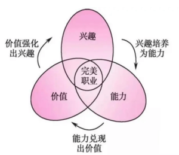

# 2.8 工作倦怠了吗，试试三叶草模型

"最近上班好累，上班如上坟.."
"不是身体累，就是...提不起劲"
"天天就想摸鱼，对工作提不起一点兴趣"

如果你也有这种感觉，不妨用三叶草模型来给自己做个诊断。

## 什么是三叶草模型？

三叶草模型是一个职业生涯规划模型，它把工作动力分成三片叶子：
- 兴趣叶：对工作的热情和喜爱程度
- 能力叶：解决问题的技术和才干
- 价值叶：工作带来的回报和意义

这三片叶子相互影响，缺一不可：
- 有兴趣，学习能力才会提升
- 有能力，才能创造更多价值
- 有价值，才能持续保持兴趣

## 三种倦怠类型

### 1. 厌倦型（兴趣叶枯萎）
表现：
- 天天盼着下班
- 看到代码就烦
- 对什么都提不起劲
- 工作完全是为了完成任务

就像我一个同事说的：
"以前看到新技术就兴奋，现在看到新框架就头大"
"记得刚工作那会儿，周末还会自己写代码，现在连IDE都不想打开"

### 2. 焦虑型（能力叶不足）
表现：
- 总觉得跟不上节奏
- 害怕接到新需求
- 看不懂同事的代码
- 技术分享时坐立难安

一个典型场景：
"产品经理说这个很简单，可我看了半天也没头绪..."
"同事两天就能写完的功能，我要写一周..."

### 3. 失落型（价值叶缺失）
表现：
- 付出没有回报
- 努力得不到认可
- 看不到职业发展
- 觉得自己是工具人

常见的抱怨：
"我优化了整个系统性能，领导说'这不是应该的吗？'"
"加班做完的方案，第二天被一句'需求变了'否定"

## 如何治愈倦怠？

### 1. 厌倦型的治疗方案

第一步：找回兴趣的源头
- 回忆当初为什么选择编程
- 列出曾经让你兴奋的技术点
- 想想最有成就感的项目

第二步：重新培养兴趣
- 尝试一个自己感兴趣的side project
- 研究一下新技术或者开源项目
- 和志同道合的同事一起做点东西

第三步：转化兴趣
- 把枯燥的工作游戏化
- 在日常工作中设立小目标
- 给自己设定技术挑战

### 2. 焦虑型的治疗方案

第一步：正视能力差距
- 列出具体的技能短板
- 设定合理的学习目标
- 制定可执行的计划

第二步：系统提升
- 每天抽固定时间学习
- 参与有挑战性的项目
- 向高手请教和学习

第三步：发挥优势
- 专注于自己擅长的领域
- 把已有技能做到极致
- 找到适合自己的位置

### 3. 失落型的治疗方案

第一步：重新定义价值
- 不只看外在回报
- 关注个人成长
- 寻找工作的意义

第二步：创造价值
- 主动承担重要任务
- 解决团队痛点问题
- 提升工作的可见度

第三步：寻找平台
- 选择更适合的团队
- 找到欣赏自己的领导
- 寻找价值观一致的环境

## 一些特别提醒

1. 三片叶子是相互影响的
- 找回兴趣，能力自然会提升
- 提升能力，价值自然显现
- 获得价值，兴趣会更浓

2. 治愈倦怠需要时间
- 不要期待立竿见影
- 给自己一个缓冲期
- 保持耐心和信心

3. 记住选择权在你
- 可以换个团队
- 可以转换方向
- 可以寻找新机会

就像调试代码一样：
- 先定位问题（哪片叶子出问题了）
- 再分析原因（为什么会这样）
- 最后解决问题（对症下药）

程序员嘛，修bug的时候都那么执着，
修复自己的倦怠，也要这么认真才行。

（好了，我要去检查我的三叶草了，最近好像有点蔫...） 