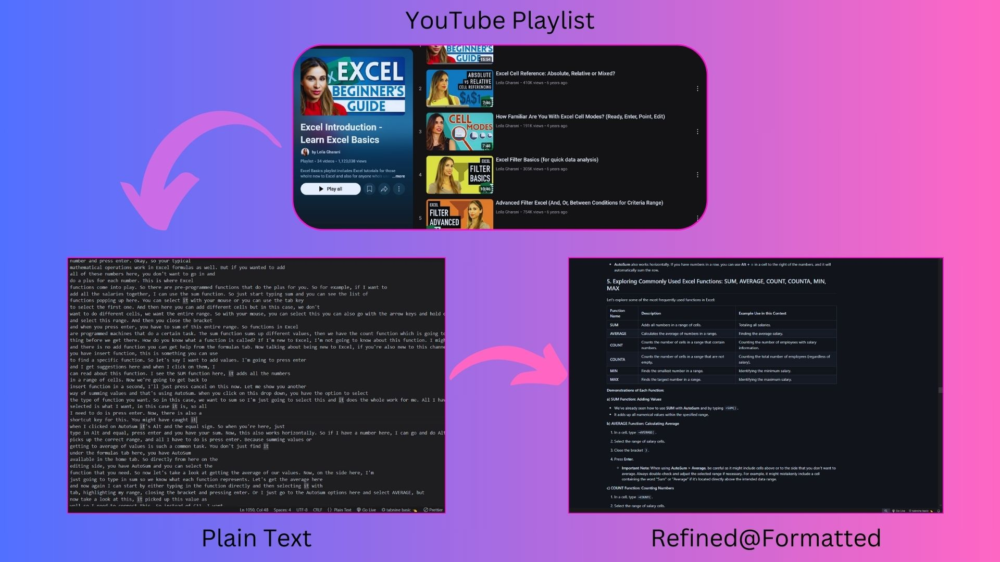
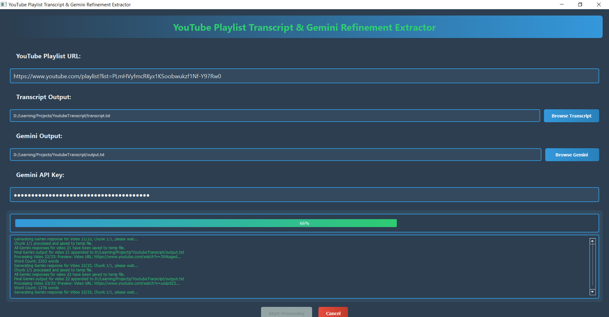

# YouTube Playlist Processor using Gemini API
<br>
<br>
✅ Added Language Support, now the output file is in the language of user's input.(might not be as good as english, test it yourself!)<br>
✅ Added single video url support, no need to put it in a playlist.

<br>
<br>
This Python application extracts transcripts from YouTube playlists and refines them using the Google Gemini API(which is free). It takes a YouTube playlist URL as input, extracts transcripts for each video, and then uses Gemini to reformat and improve the readability of the combined transcript. The output is saved as a text file.
<br><br>
So you can have a neatly formatted book out of a YouTube playlist!
I personally use it to convert large YouTube playlists containing dozens of long videos into a very large organized markdown file to give it as input to NotebookLM as one source.<br><br>

Read more about it in this [Medium Article](https://medium.com/@ebrahimgolriz444/a-tool-to-turn-entire-youtube-playlists-to-markdown-formatted-and-refined-text-books-in-any-3e8742f5d0d3)
<br><br>

*   Batch processing of entire playlists
*   Refine transcripts using Google Gemini API for improved formatting and readability.
*   User-friendly PyQt5 graphical interface.
*   Selectable Gemini models.
*   Output to markdown file.
<br><br><br><br>
<br><br>




## Features
- 🎥 Automatic transcript extraction from YouTube playlists
- 🧠 AI-powered text refinement using Gemini models
- 📁 Configurable output file paths
- ⏳ Progress tracking for both extraction and refinement
- 📄 Output to formatted markdown file.

## Requirements
- Python 3.9+
- Google Gemini API key
- YouTube playlist URL

## Installation
```bash
pip install -r requirements.txt
```
## How does it work?
* First, the transcript of every video in the playlist is fetched.
* since gemini api doesnt have unlimited context window for input and output, the text for each video gets divided into chunks(right now, chunk size is set to 3000 after testing, but it can be changed)
* Each text chunk is then sent to the Gemini API, along with a context prompt that includes the previously refined text. This helps maintain consistency and coherence across chunks.
* The refined output from Gemini for each chunk is appended to the final output file.
* This process is repeated for every video in the playlist, resulting in a single, refined transcript output file for the entire playlist.
    
## Usage

1.  **Get a Gemini API Key:** You need a Google Gemini API key. Obtain one from [Google AI Studio](https://ai.google.dev/gemini-api/docs/api-key).
2.  **Run the Application:**
    ```bash
    python main.py
    ```
3.  **In the GUI:**
    *   Enter the YouTube Playlist URL in the "YouTube Playlist URL" field.
    *   Choose output file locations for the transcript and Gemini refined text using the "Browse" buttons.
    *   Enter your Gemini API key in the "Gemini API Key" field.
    *   Click "Start Processing".
    *   You can select a Gemini model.
    *   Wait for the processing to complete. Progress will be shown in the progress bar and status display.
    *   The output files will be saved to the locations you specified.
  

> YouTube playlist used for example files : https://www.youtube.com/playlist?list=PLmHVyfmcRKyx1KSoobwukzf1Nf-Y97Rw0
