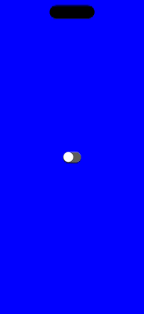

# ScreenShieldKit

[](https://swiftpackageindex.com/Kyle-Ye/ScreenShieldKit) [](https://swiftpackageindex.com/Kyle-Ye/ScreenShieldKit)

A Swift framework to hide UIView/NSView/CALayer from being captured when taking screenshots.

## Overview

| **Workflow** | **Status** |
|-|:-|
| **iOS UI Tests** | [](https://github.com/Kyle-Ye/ScreenShieldKit/actions/workflows/ios.yml) |



## Getting Started

In your `Package.swift` file, add the following dependency to your `dependencies` argument:

```swift
.package(url: "https://github.com/Kyle-Ye/ScreenShieldKit.git", from: "0.1.0"),
```

Then add the dependency to any targets you've declared in your manifest:

```swift
.target(
    name: "MyTarget", 
    dependencies: [
        .product(name: "ScreenShieldKit", package: "ScreenShieldKit"),
    ]
),
```

## Usage

Instead of wrapping your view in a secure UITextField or [ScreenShieldView](https://github.com/RyukieSama/Swifty),

you can just directly call the `hideFromCapture(hidden:)` API on your view or layer.

```swift
import ScreenShieldKit

let view = UIView(frame: .zero)
view.hideFromCapture(hidden: true)

// Resture the behavior
view.hideFromCapture(hidden: false)
```

Detailed documentation for ScreenShieldKit can be found on the [Swift Package Index](https://swiftpackageindex.com/Kyle-Ye/ScreenShieldKit/main/documentation/screenshieldkit).

## License

See LICENSE file - MIT

## Credits

https://nsantoine.dev/posts/CALayerCaptureHiding